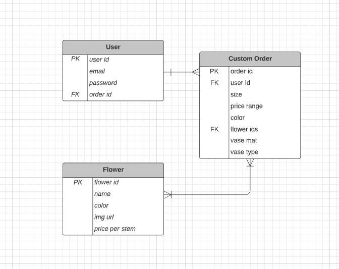
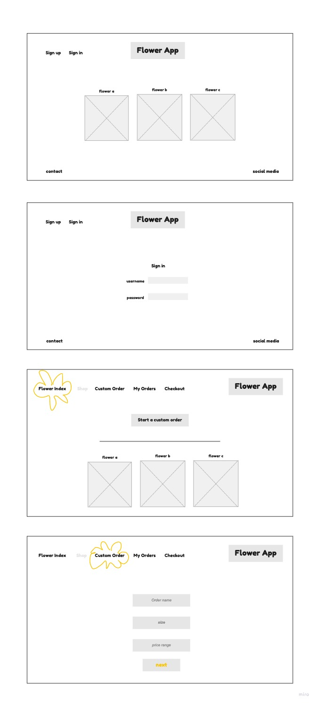
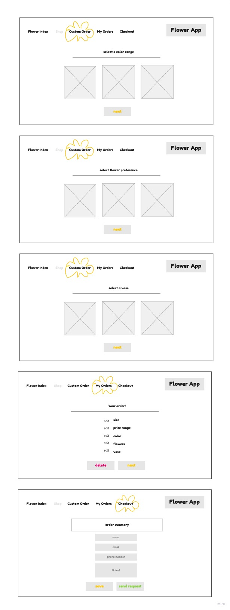

# Flower App
## A Custom Floral Ordering App ##
*SEI Capstone Project / Front-end*
___
Shears & Roots is a floral ordering app that allows customers to fully customize their order by color, price, size, and floral type. The app also contains a member only access to a floral dictionary collection.
___
## Tech Used
- Python
- Django
- SQL
- React

[Link to API repo](https://github.com/katherine-kania/project-4-api)
___
A Public User has access to..
- curated collection of the floral dictionary
- browsing the shop
- signing up

A Logged in User has access to..
- loging in
- the full collection of the floral dictionary
- building a customized floral order by
    - size
    - price range
    - color range
    - flower types
    - vase type and material
    - floral styles
    - adding personal info and contact
    - deleting, adding to checkout or sending the request order to florist
- edit the selections in custom orders and cart

Stretch Goals..
- ready to buy marketplace
- houseplant dictionary 
- customizable houseplant 

## ERD

## Wireframes

